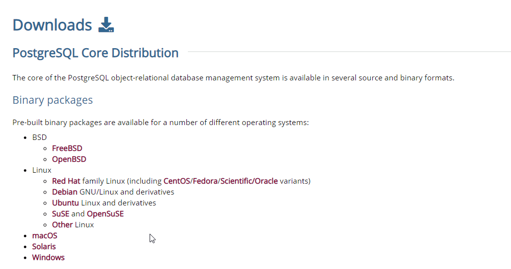
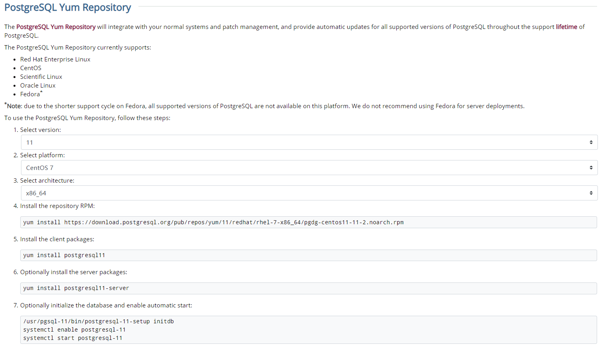

# PostgreSQL的安装和配置

PostgreSQL是以[加州大学](https://baike.baidu.com/item/%E5%8A%A0%E5%B7%9E%E5%A4%A7%E5%AD%A6)伯克利分校计算机系开发的 POSTGRES，现在已经更名为PostgreSQL的对象[关系型数据库管理系统](https://baike.baidu.com/item/%E5%85%B3%E7%B3%BB%E5%9E%8B%E6%95%B0%E6%8D%AE%E5%BA%93%E7%AE%A1%E7%90%86%E7%B3%BB%E7%BB%9F)（ORDBMS）。PostgreSQL支持大部分 SQL标准并且提供了许多其他现代特性：复杂查询、[外键](https://baike.baidu.com/item/%E5%A4%96%E9%94%AE/1232333)、[触发器](https://baike.baidu.com/item/%E8%A7%A6%E5%8F%91%E5%99%A8/16782)、视图、[事务](https://baike.baidu.com/item/%E4%BA%8B%E5%8A%A1/5945882)完整性、[MVCC](https://baike.baidu.com/item/MVCC)。同样，PostgreSQL 可以用许多方法扩展，比如， 通过增加新的数据类型、函数、操作符、[聚集函数](https://baike.baidu.com/item/%E8%81%9A%E9%9B%86%E5%87%BD%E6%95%B0/6704258)、索引。免费使用、修改、和分发 PostgreSQL，不管是私用、商用、还是学术研究使用。

## 安装

1. 打开[官网下载](https://www.postgresql.org/download/)页面选择对应系统版本。

   

2. 选择系统后，根据情况选择适合的安装方式，以yum为例，官方提供了详细的步骤。

   

3. 验证是否安装成功

   ``` shell
   [root@localhost network-scripts]# su postgres
   bash-4.2$ psql
   psql (11.2)
   输入 "help" 来获取帮助信息.
   
   postgres=#
   ```

## 配置

- **修改PostgresSQL数据库配置实现远程访问**

  ``` shell
  vi /etc/postgresql/11/main/postgresql.conf  
  # 监听任何地址访问，修改连接权限
  #listen_addresses = 'localhost'      改为 listen_addresses = '*'
  vi /etc/postgresql/9.4/main/pg_hba.conf  
  # 在文档末尾加上以下内容
  host all all 0.0.0.0 0.0.0.0 md5
  # 重启服务
  systemctl restart postgresql-11
  ```

- **开放端口**

  ```
  firewall-cmd --zone=public --add-port=5432/tcp --permanent
  firewall-cmd --reload
  ```

  