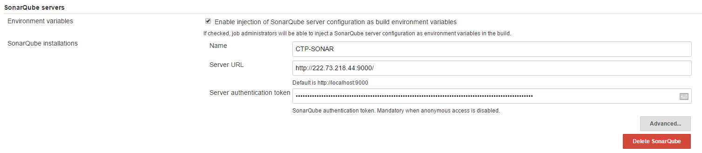
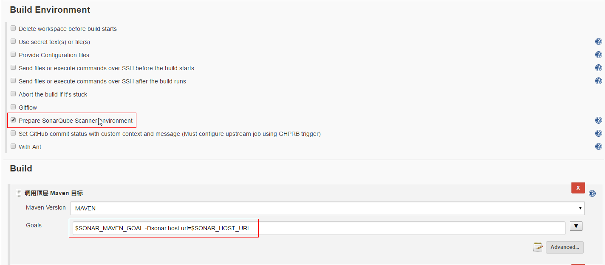

# SONAR在CTP项目中的部署和使用

Sonar是一个用于代码质量管理的开源平台，用于管理Java源代码的质量。通过插件机制，Sonar 可以集成不同的测试工具，代码分析工具，以及持续集成工具，比如pmd-cpd、checkstyle、findbugs、Jenkins。通过不同的插件对这些结果进行再加工处理，通过量化的方式度量代码质量的变化，从而可以方便地对不同规模和种类的工程进行代码质量管理。同时 Sonar 还对大量的持续集成工具提供了接口支持，可以很方便地在持续集成中使用 Sonar。 此外，Sonar 的插件还可以对 Java 以外的其他编程语言提供支持，对国际化以及报告文档化也有良好的支持。

> 官方文档：https://docs.sonarqube.org/latest

## SonarQube安装和部署

1. 下载，选择LTS版本，当前版本为`6.7.6`，访问[sonar官网](https://www.sonarqube.org/downloads/)查看最新版本

   ``` shell
   wget https://binaries.sonarsource.com/Distribution/sonarqube/sonarqube-7.6.zip
   ```

2. 解压到目的路径`/usr/local`

   ``` shell
   unzip sonarqube-6.7.6.zip
   ```

3. 创建用户sonar并添加权限，es不允许使用root用户启动，所以运行sonar的时候必须要新创建其它用户，然后用创建的用户启动sonar。

   ``` shell
   groupadd sonar
   useradd sonar
   chown -R sonar:sonar /usr/local/sonarqube-6.7.6.zip
   ```

4. 配置数据库

   ``` shell
   vim /usr/local/sonarqube-6.7.6.zip/conf/sonar.porporities
   
   sonar.jdbc.username=
   sonar.jdbc.password=
   sonar.jdbc.url=jdbc:postgresql://
   
   ```

5. 启动sonar

   ``` shell
   cd /usr/local/sonarqube-6.7.6/bin/linux-x86-64
   ./sonar.sh start
   ```

6. 浏览器打开ip:9000，成功打开页面说明启动成功。

   

## 搭配Jenkins使用SonerQube扫描

1. `Jenkins`-`系统管理`-`插件管理`安装SonarQube插件。

   

2. `Jenkins`-`系统管理`-`系统设置`指定SonarQube服务地址。其中token在SonarQube控制台中的账户中生成。

   

3. `Jenkins`-`系统管理`-`全局工具配置`指定`SonarScanner`。

   在Jenkins服务器中安装Scanner，[下载地址](https://docs.sonarqube.org/display/SCAN/Analyzing+with+SonarQube+Scanner)，下载后解压。完成后在Jenkin中指定。

   

4. 在Jenkins项目中配置。

   对于Maven项目，只需在项目-配置中启用构建环境的`Prepare SonarQube Scanner environment`，同时指定maven的构建目标为`$SONAR_MAVEN_GOAL -Dsonar.host.url=$SONAR_HOST_URL`，下次构建就能在SonarQube的控制台界面看到该项目的扫描结果。

   

   对于非Maven或非Gradle项目，可在构建中添加步骤`Execute SonarQube Scanner`，然后指定项目扫描配置文件（若有），或自定义配置参数即可。

   

   

Jenkins执行构建后，SonarQube控制台界面如下：


