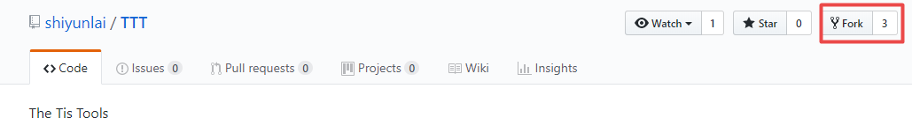
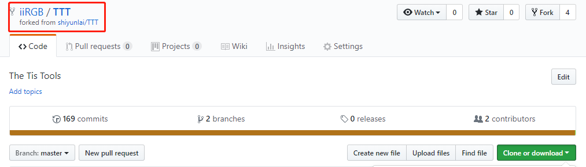
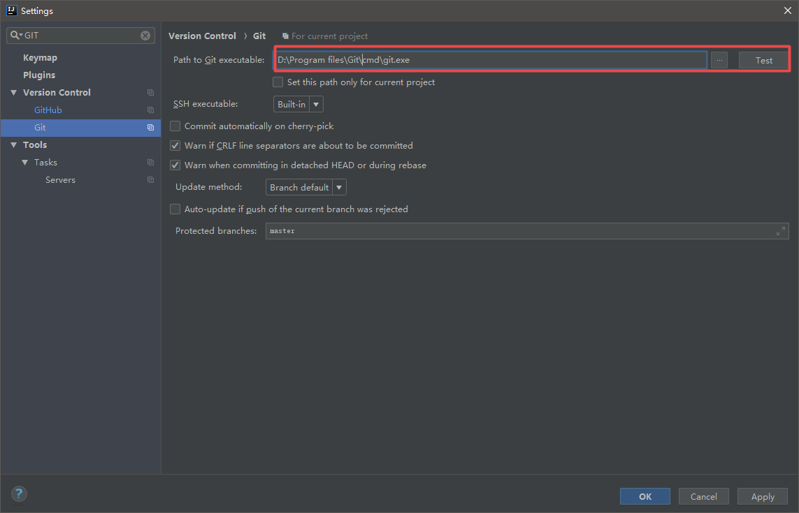
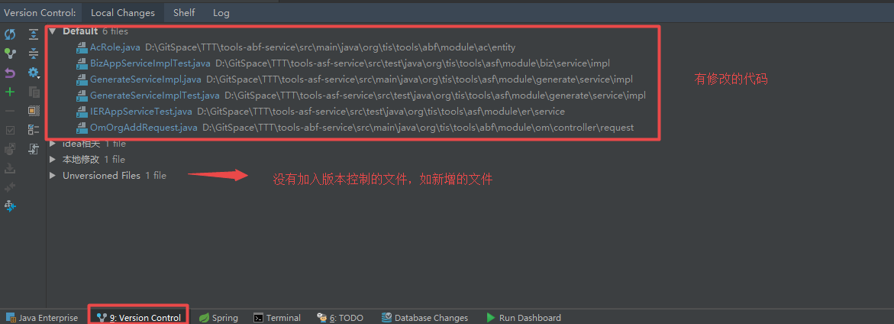
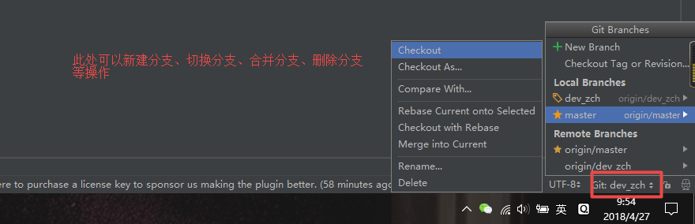
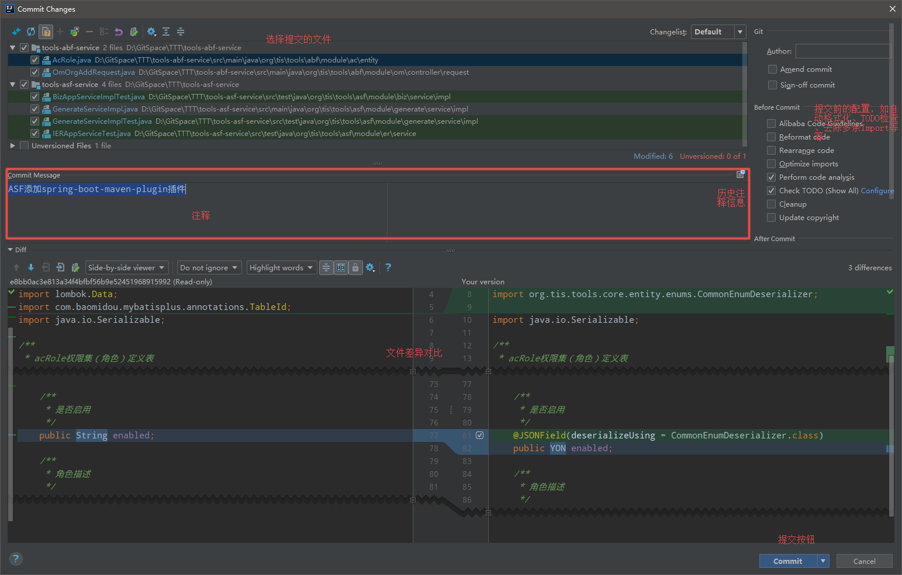
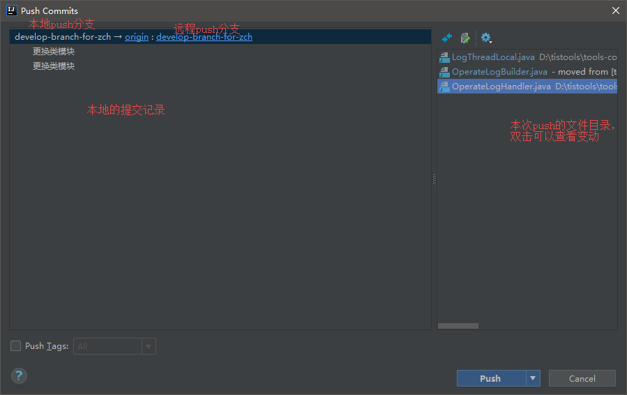
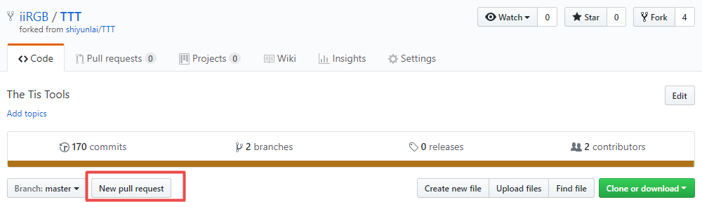
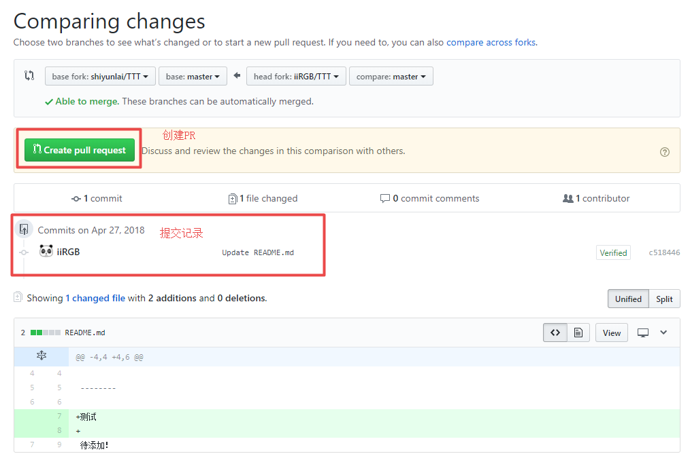
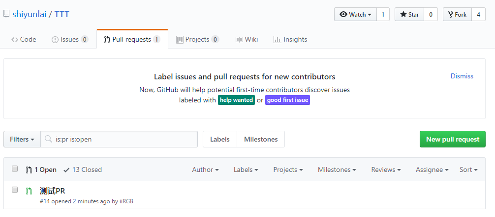

## FORK

1. 登录GITHUB

2. 进入 [TTT](https://github.com/shiyunlai/TTT) 项目GITHUB地址 ，点击右上角Fork

3. 成功后就会跳转到fork后自己的仓库中，这时该项目就属于自己了。

   

4. 按之前导入项目方法到本地就可以了

   ​

## 使用 IDEA 提交代码

1. 配置环境，在框中设置本地GIT的路径

   

2. 使用IDEA工具栏 Version Control

   

3. 使用IDEA 的分支工具

   

4. 提交代码，Ctrl + K 快捷键或点击图标或右击变动文件在菜单中点击 commit file.. 弹出提交对话框

   

5. Push到Github，Ctrl + Shift  + K快捷键或右击菜单中选择Git > Repository > Push 打开 Push对话框!

6. 成功后登录GITHUB，就可以在提交记录中看到本次的提交

## Pull Request

上一节提交只是把代码提交到了fork后的自己的仓库，我们还需要将代码提交到主库之中。这时就需要使用GITHUB中的`Pull Request`简称 `PR`。

点击 New pull request 跳转到 PR页面

点击Create pull request, 在跳转页面填写注释，点击按钮就成功创建了一个PR，在主库的Pull Request中可以看到该PR。

