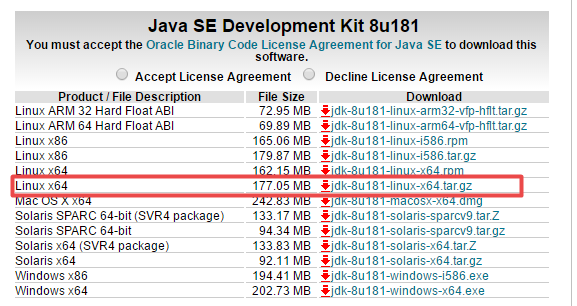

# 阿里云CentOS安装JDK

要部署的服务多了，原有的服务器撑不住，公司买了新的云服务，之前装过环境，再装一次已经忘了，故记录这一次安装过程，以供将来查看。

## 安装过程

- 下载JDK

  登录oracle官网，JDK最新已经到10了，不过这一次我们只用下载JDK 8，所以打开[下载页面](http://www.oracle.com/technetwork/java/javase/downloads/jdk8-downloads-2133151.html，右击复制[下载地址](http://download.oracle.com/otn-pub/java/jdk/8u181-b13/96a7b8442fe848ef90c96a2fad6ed6d1/jdk-8u181-linux-x64.tar.gz)。



- 登录服务器下载解压

  这一步我们可以先在本地下载好，通过ftp命令上传到云服务器上面，也可以直接在云服务下载解压

  ``` shell
  cd ~ # 到当前用户下的目录
  mkdir downloads # 新建一个文件夹专用于下载，后续可以删除
  wget http://download.oracle.com/otn-pub/java/jdk/8u181-b13/96a7b8442fe848ef90c96a2fad6ed6d1/jdk-8u181-linux-x64.tar.gz # 下载安装包
  
  # 下载ok
  100%[===========================================>] 5,307       --.-K/s   in 0s      
  2018-08-22 16:50:45 (487 MB/s) - ‘jdk-8u181-linux-x64.tar.gz’ saved [5307/5307]
  
  su root # 安装jdk需要使用root用户
  mkdir /opt/jdk # 将jdk安装到/opt/jdk目录
  tar -zxvf jdk-8u181-linux-x64.tar.gz -C /opt/jdk
  ```

  这时候报错了

  ``` shell
  gzip: stdin: not in gzip format 
  tar: Child returned status 1 
  tar: Error is not recoverable: exiting now 
  ```

  原因是`wget`下载的文件不是真正的安装包，大小只有5307B，oracle在下载前需要accept协议，重新获取真正的下载地址后，就可以正确下载解压了

  ```shell
  tar -zxvf jdk-8u181-linux-x64.tar.gz -C /opt/jdk
  
  ...
  jdk1.8.0_181/jre/lib/fontconfig.SuSE.10.properties.src
  jdk1.8.0_181/jre/lib/fontconfig.SuSE.11.bfc
  jdk1.8.0_181/jre/COPYRIGHT
  jdk1.8.0_181/jre/THIRDPARTYLICENSEREADME-JAVAFX.txt
  jdk1.8.0_181/jre/Welcome.html
  jdk1.8.0_181/jre/README
  jdk1.8.0_181/README.html
  # 解压成功
  ```

- 删除压缩包（可选）

  云服务容量很珍贵，我们删除掉安装包

  ```shell
  rm -f jdk-8u181-linux-x64.tar.gz
  ```

- 配置JDK环境变量

  ``` shell
  vi /etc/profile
  # 在文件尾加入
  # java environment
  export JAVA_HOME=/opt/jdk
  export JRE_HOME=$JAVA_HOME/jre
  export CLASSPATH=.:$JAVA_HOME/lib/dt.jar:$JAVA_HOME/lib/tools.jar
  export PATH=$PATH:$JAVA_HOME/bin:$JRE_HOME
  
  source /etc/profile # 配置生效
  java -verion # java -v 会报错，折腾了十分钟 —。—|||
  java version "1.8.0_181"
  Java(TM) SE Runtime Environment (build 1.8.0_181-b13)
  Java HotSpot(TM) 64-Bit Server VM (build 25.181-b13, mixed mode)
  ```

  