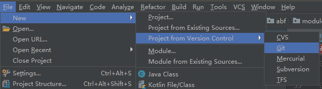
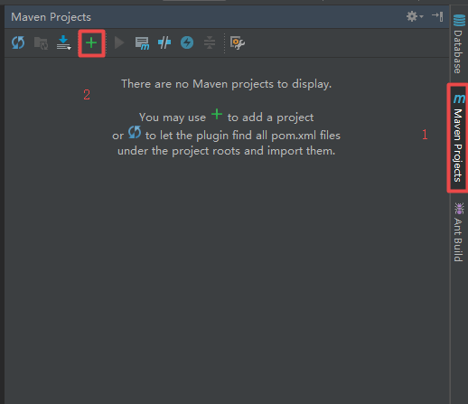
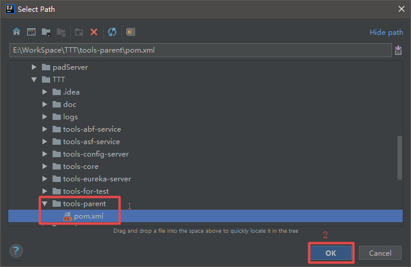
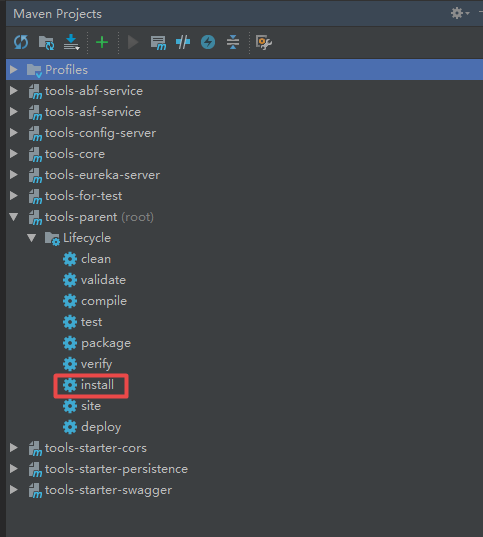
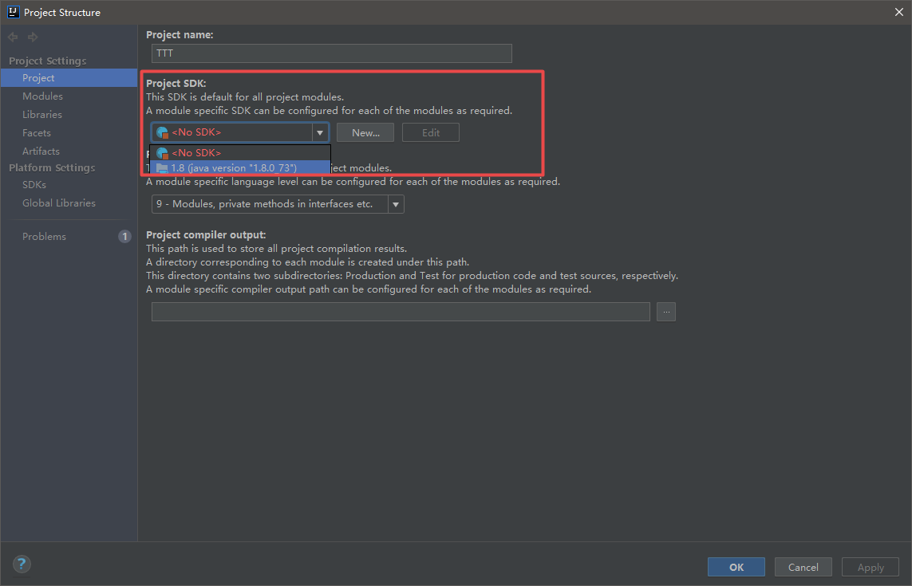

## 启动步骤

### 获取代码

1. 安装GIT环境，使用clone命令获取代码，或者到GITHUB下载zip包

``` git
git clone https://github.com/shiyunlai/TTT.git
```

2. 使用IDEA的 `File > New > Project from Version Control > Git`，然后输入git地址指定项目路径，点击`clone`即可。

   

### IDEA导入项目

1. 按上一节第一步方法获取的代码：通过 `File > open`然后选择工程目录打开，第二种方式的跳过这一步。

2. 将项目配置为Maven项目：点击左下角的图标显示工具栏

   打开右侧Maven工具栏，点击 + 号

   

   TTT 项目为多模块工程，所以只需添加`tools-parent`下的pom文件即可，maven会自动添加它的子模块到项目中

   

   添加完如下：

   

   双击上图中的install，等待构建成功。

### 配置JDK

点击左上角的或者 FIle > Project Structure 或者 Alt + Ctrl + Shift + S 打开对话框，按图设置。



### 启动项目

运行`TTT\tools-abf-service\src\main\java\org\tis\tools\abf\ToolsAbfServiceApplication.java`中的`main`方法即可。

### 问题

1. 如果导入失败，可以去工程文件目录下删除.idea文件夹，重新导入即可。
2. Maven配置了阿里云镜像的，会找不到 pinyin4j 的依赖，按依赖的`groupId`手动将该依赖解压到仓库即可。

