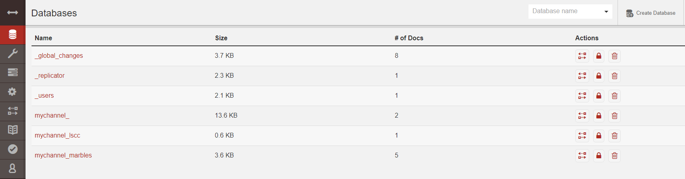

# 建立网络

在环境搭建中介绍了如何搭建环境和启动样例程序。

如果想了解有关底层工具和引导机制的更多信息，请继续阅读。在接下来的部分中将介绍构建全功能Hyperledger Fabric网络的各种步骤和要求

## 密码生成器 Crypto Generator

`cryptogen`工具为各种网络实体生成加密材料（x509证书和签名密钥）。这些证书代表身份，它们允许在我们的实体进行通信和交易时进行签名/验证身份验证。

### 如何工作

Cryptogen使用文件 `crypto-config.yaml`，它包含了网络拓扑，并允许我们为org及其组件生成一组证书和密钥。每个org都配置了一个唯一的根证书（`ca-cert`），用于将特定组件（peers和orderers）绑定到该org。通过为每个org分配唯一的CA证书，我们模仿典型的网络，其中参与的[成员](https://hyperledger-fabric.readthedocs.io/en/latest/glossary.html#member)将使用其自己的证书颁发机构。Hyperledger Fabric中的事务和通信由实体的私钥`keystore`签名，然后通过公钥`signcerts`进行验证。

此文件中的变量`count`用来指定每个org的peers数量; 在例子中，每个Org有两个peers

``` yaml
# ---------------------------------------------------------------------------
# "OrdererOrgs" - 定义管理orderer节点的机构
#                 Definition of organizations managing orderer nodes
# ---------------------------------------------------------------------------
OrdererOrgs:
  # ---------------------------------------------------------------------------
  # Orderer
  # ---------------------------------------------------------------------------
  - Name: Orderer
    Domain: example.com
    # ---------------------------------------------------------------------------
    # "Specs" - See PeerOrgs below for complete description
    # ---------------------------------------------------------------------------
    Specs:
      - Hostname: orderer
# ---------------------------------------------------------------------------
# "PeerOrgs" - Definition of organizations managing peer nodes
# ---------------------------------------------------------------------------
PeerOrgs:
  # ---------------------------------------------------------------------------
  # Org1
  # ---------------------------------------------------------------------------
  - Name: Org1
    Domain: org1.example.com
    EnableNodeOUs: true
    # ---------------------------------------------------------------------------
    # "Specs"
    # ---------------------------------------------------------------------------
    # 取消注释本节以启用配置中主机的显式定义，大多数用户想要使用Template，下面的一组规范实体，
    # 每个规范是一组规范实体。每个规范实体包含两个属性：
    # - Hostname：（必填）所需的主机名，不包含域。
    # - CommonName: (可选) 指定模板或者显式重写CommonName,默认模板为：
    #                            "{{.Hostname}}.{{.Domain}}"
    #                各自从Spec.Hostname和Org.Domain获取值。
    #
    # Uncomment this section to enable the explicit definition of hosts in your
    # configuration.  Most users will want to use Template, below
    # Specs is an array of Spec entries.  Each Spec entry consists of two fields:
    #   - Hostname:   (Required) The desired hostname, sans the domain.
    #   - CommonName: (Optional) Specifies the template or explicit override for
    #                 the CN.  By default, this is the template:
    #
    #                              "{{.Hostname}}.{{.Domain}}"
    #
    #                 which obtains its values from the Spec.Hostname and
    #                 Org.Domain, respectively.
    # ---------------------------------------------------------------------------
    # Specs:
    #   - Hostname: foo # implicitly "foo.org1.example.com"
    #     CommonName: foo27.org5.example.com # overrides Hostname-based FQDN set above
    #   - Hostname: bar
    #   - Hostname: baz
    # ---------------------------------------------------------------------------
    # "Template"
    # ---------------------------------------------------------------------------
    # Allows for the definition of 1 or more hosts that are created sequentially
    # from a template. By default, this looks like "peer%d" from 0 to Count-1.
    # You may override the number of nodes (Count), the starting index (Start)
    # or the template used to construct the name (Hostname).
    # 通过模板可以定义多个host,默认会生成类似“peer%d”从0到Count-1,可以重写节点数Count，
    # 开始地址（Startt）或者模板用来构造名称。
    # Note: Template and Specs are not mutually exclusive.  You may define both
    # sections and the aggregate nodes will be created for you.  Take care with
    # name collisions
    # 注意：模板和规范并不是相互排斥的。您可以定义这两个部分，并为您创建聚合节点。注意名称冲突。
    # ---------------------------------------------------------------------------
    Template:
      Count: 2
      # Start: 5
      # Hostname: {{.Prefix}}{{.Index}} # default
    # ---------------------------------------------------------------------------
    # "Users"
    # ---------------------------------------------------------------------------
    # Count: The number of user accounts _in addition_ to Admin
    # ---------------------------------------------------------------------------
    Users:
      Count: 1
  # ---------------------------------------------------------------------------
  # Org2: See "Org1" for full specification
  # ---------------------------------------------------------------------------
  - Name: Org2
    Domain: org2.example.com
    EnableNodeOUs: true
    Template:
      Count: 2
    Users:
      Count: 1
```

网络实体的命名约定如下 - “{{.Hostname}}.{{.Domain}}”。因此，使用排序节点作为参考点，留下了排序节点 - `orderer.example.com`它与`Orderer`的一个MSP ID相关联。

## 配置交易生成器 Configuration Transaction Generator

`configtxgen`工具用于创建四个配置工件：

- orderer 创世块`genesis block`
- channel `configuration transaction`
- 两个`anchor peer transactions`,每个Org的Peer 各一个。

orderer块是排序服务的[Genesis Block](https://hyperledger-fabric.readthedocs.io/en/latest/glossary.html#genesis-block)，channel 的`configuration transaction`文件在[Channel](https://hyperledger-fabric.readthedocs.io/en/latest/glossary.html#channel)创建时广播到orderer。正如名称所暗示的那样，指定每个Org在它的channel上的[Anchor Peer](https://hyperledger-fabric.readthedocs.io/en/latest/glossary.html#anchor-peer)。

### 如何工作

`Configtxgen`使用文件  `configtx.yaml`,它包含示例网络的定义。有三个成员 ：一个Orderer Org（`OrdererOrg`）和两个Peer Orgs （`Org1`＆`Org2`），每个成员管理和维护两个Peer节点。该文件还指定了一个组合- `SampleConsortium`由两个Peer Orgs组成。请特别注意此文件的“Profiles”部分。会注意到有两个唯一标头。一个用于orderer genesis块 - `TwoOrgsOrdererGenesis`和一个用于channel - `TwoOrgsChannel`。

这些头文件很重要，因为我们将在创建工件时将它们作为参数传递。此文件还包含两个值得注意的其他规范。首先，我们为每个Peer Org（`peer0.org1.example.com`＆`peer0.org2.example.com`）指定锚点对等体。其次，指向每个成员的MSP目录的位置，从而允许我们在orderer genesis块中存储每个Org的根证书。这是一个关键概念。与orderer服务通信的任何网络实体都可以验证其数字签名。

```yaml
---
################################################################################
#
#   Section: Organizations 组织
#
#   - This section defines the different organizational identities which will
#   be referenced later in the configuration.
#   - 该小节定义了不同的机构，在配置中会被引用
#
################################################################################
Organizations:

    # SampleOrg defines an MSP using the sampleconfig.  It should never be used
    # in production but may be used as a template for other definitions
    # SampleOrg使用简单配置定义了MSP.它不会用于生产中，但是可用于其他定义的模板
    - &OrdererOrg
        # DefaultOrg defines the organization which is used in the sampleconfig
        # of the fabric.git development environment
        # DefaultOrg定义了用于fabric.git开发环境sampleConfig的机构
        Name: OrdererOrg

        # ID to load the MSP definition as 用于加载MSP定义
        ID: OrdererMSP

        # MSPDir is the filesystem path which contains the MSP configuration
        # MSPDir 是包含MSP配置的文件路径
        MSPDir: crypto-config/ordererOrganizations/example.com/msp

    - &Org1
        Name: Org1MSP
        ID: Org1MSP
        MSPDir: crypto-config/peerOrganizations/org1.example.com/msp
        AnchorPeers:
            # AnchorPeers defines the location of peers which can be used
            # for cross org gossip communication.  Note, this value is only
            # encoded in the genesis block in the Application section context
            # AnchorPeers定义peers的位置，可以用于交叉org传播通信。
            # 注意，此值仅在应用程序部分上下文中的创世块中进行编码。
            - Host: peer0.org1.example.com
              Port: 7051

    - &Org2
        Name: Org2MSP
        ID: Org2MSP
        MSPDir: crypto-config/peerOrganizations/org2.example.com/msp
        AnchorPeers:
            - Host: peer0.org2.example.com
              Port: 7051

################################################################################
#
#   SECTION: Capabilities 能力
#
#   - This section defines the capabilities of fabric network. This is a new
#   concept as of v1.1.0 and should not be utilized in mixed networks with
#   v1.0.x peers and orderers.  Capabilities define features which must be
#   present in a fabric binary for that binary to safely participate in the
#   fabric network.  For instance, if a new MSP type is added, newer binaries
#   might recognize and validate the signatures from this type, while older
#   binaries without this support would be unable to validate those
#   transactions.  This could lead to different versions of the fabric binaries
#   having different world states.  Instead, defining a capability for a channel
#   informs those binaries without this capability that they must cease
#   processing transactions until they have been upgraded.  For v1.0.x if any
#   capabilities are defined (including a map with all capabilities turned off)
#   then the v1.0.x peer will deliberately crash.
#
#   这部分定义了fabric网络的能力。这是V1.1.0的一个新概念，不应该用于V1.0.x peers和orderers
#   的混合网络中。Capabilities定义了必须存在于fabric二进制文件中的特性，以便该二进制文件
#   能够安全地参与fabric网络。例如，如果添加了新的MSP类型，则较新的二进制文件可能识别
#   并验证来自这种类型的签名，而没有这种支持的较旧的二进制文件将无法验证那些事务。这可能导致
#   不同版本的fabric二进制文件具有不同世界状态的。相反，为通道定义Capabilities会通知那些没有此
#   功能的二进制文件在升级之前必须停止处理事务。对于V1.0.x，如果定义了任何Capabilities
#   （包括关闭所有功能的映射）V1.0.x peer会故意崩溃。
#
################################################################################
Capabilities:
    # Channel capabilities apply to both the orderers and the peers and must be
    # supported by both.  Set the value of the capability to true to require it.
    # Channel能力会同时应用到orderer和peers,所以二者都必须支持，设置能力值为true表示必须
    Global: &ChannelCapabilities
        # V1.1 for Global is a catchall flag for behavior which has been
        # determined to be desired for all orderers and peers running v1.0.x,
        # but the modification of which would cause incompatibilities.  Users
        # should leave this flag set to true.
        # V1.1对于全局来说是一个行为的标记，它被确定为所有运行在V1.0x上的orderers和peers。
        # 修改会导致不兼容。用户应该将此标志设置为true。
        V1_1: true

    # Orderer capabilities apply only to the orderers, and may be safely
    # manipulated without concern for upgrading peers.  Set the value of the
    # capability to true to require it.
    # Orderer能力只应用到orderers,可以安全地操纵而不关心升级Peers。将值设置为true以要求它。
    Orderer: &OrdererCapabilities
        # V1.1 for Order is a catchall flag for behavior which has been
        # determined to be desired for all orderers running v1.0.x, but the
        # modification of which  would cause incompatibilities.  Users should
        # leave this flag set to true.
        # V1.1对于Order来说是一个行为的标记，它被确定为所有运行在V1.0x上的orderers。
        # 修改会导致不兼容。用户应该将此标志设置为true。
        V1_1: true

    # Application capabilities apply only to the peer network, and may be safely
    # manipulated without concern for upgrading orderers.  Set the value of the
    # capability to true to require it.
    # Application能力只应用到peer,可以安全地操纵而不关心升级orderers。将值设置为true以要求它。
    Application: &ApplicationCapabilities
        # V1.2 for Application is a catchall flag for behavior which has been
        # determined to be desired for all peers running v1.0.x, but the
        # modification of which would cause incompatibilities.  Users should
        # leave this flag set to true.
        V1_2: true

################################################################################
#
#   SECTION: Application 应用
#   - 本节定义了用于将应用程序相关参数编码到配置事务或创世块中的值。
#   - This section defines the values to encode into a config transaction or
#   genesis block for application related parameters
#
################################################################################
Application: &ApplicationDefaults

    # Organizations is the list of orgs which are defined as participants on
    # the application side of the network
    # Organizations 定义了网络中应用端的参与者的ORG列表。
    Organizations:

################################################################################
#
#   SECTION: Orderer
#
#   - This section defines the values to encode into a config transaction or
#   genesis block for orderer related parameters
#   本节定义了将与orderer相关的参数值编码到配置事务或创世块中的。
################################################################################
Orderer: &OrdererDefaults

    # Orderer Type: The orderer implementation to start
    # Available types are "solo" and "kafka"
    # 类型：solo和kafka
    OrdererType: solo

    Addresses:
        - orderer.example.com:7050

    # Batch Timeout: The amount of time to wait before creating a batch
    # 创建批次的超时时间
    BatchTimeout: 2s

    # Batch Size: Controls the number of messages batched into a block
    # 控制批处理的消息数量
    BatchSize:

        # Max Message Count: The maximum number of messages to permit in a batch
        # 批处理中允许的最大消息数
        MaxMessageCount: 10

        # Absolute Max Bytes: The absolute maximum number of bytes allowed for
        # the serialized messages in a batch.
        # 设置最大的区块大小。批处理中序列化消息所允许的绝对最大字节数。
        AbsoluteMaxBytes: 99 MB

        # Preferred Max Bytes: The preferred maximum number of bytes allowed for
        # the serialized messages in a batch. A message larger than the preferred
        # max bytes will result in a batch larger than preferred max bytes.
        # 设置每个区块建议的大小。
        PreferredMaxBytes: 512 KB

    Kafka:
        # Brokers: A list of Kafka brokers to which the orderer connects
        # NOTE: Use IP:port notation
        Brokers:
            - 127.0.0.1:9092

    # Organizations is the list of orgs which are defined as participants on
    # the orderer side of the network
    Organizations:

################################################################################
#
#   Profile
#
#   - Different configuration profiles may be encoded here to be specified
#   as parameters to the configtxgen tool
#
################################################################################
Profiles:

    TwoOrgsOrdererGenesis:
        Capabilities:
            <<: *ChannelCapabilities
        Orderer:
            <<: *OrdererDefaults
            Organizations:
                - *OrdererOrg
            Capabilities:
                <<: *OrdererCapabilities
        Consortiums:
            SampleConsortium:
                Organizations:
                    - *Org1
                    - *Org2
    TwoOrgsChannel:
        Consortium: SampleConsortium
        Application:
            <<: *ApplicationDefaults
            Organizations:
                - *Org1
                - *Org2
            Capabilities:
                <<: *ApplicationCapabilities

```

## 运行工具

使用`cryptogen`和`configtxgen`命令手动生成证书/密钥和各种配置工件

### 手动生成工件

运行该`cryptogen`工具后，生成的证书和密钥（即MSP材料）将保存到`crypto-config`的文件夹中。

```shell
cryptogen generate --config=./crypto-config.yaml # 命令
# 输出
org1.example.com
org2.example.com
```

调用该`configtxgen`工具来创建orderer genesis块

``` shell
# -profile TwoOrgsOrdererGenesis 指定configtx.yaml中的配置TwoOrgsOrdererGenesis
# -outputBlock 指定生成区块的路径及文件名
configtxgen -profile TwoOrgsOrdererGenesis -outputBlock ./channel-artifacts/genesis.block

# 结果
2018-09-26 16:29:11.591 CST [common/tools/configtxgen] main -> WARN 001 Omitting the channel ID for configtxgen is deprecated.  Explicitly passing the channel ID will be required in the future, defaulting to 'testchainid'.
# 加载配置
2018-09-26 16:29:11.591 CST [common/tools/configtxgen] main -> INFO 002 Loading configuration
2018-09-26 16:29:11.600 CST [common/tools/configtxgen/encoder] NewChannelGroup -> WARN 003 Default policy emission is deprecated, please include policy specificiations for the channel group in configtx.yaml
2018-09-26 16:29:11.600 CST [common/tools/configtxgen/encoder] NewOrdererGroup -> WARN 004 Default policy emission is deprecated, please include policy specificiations for the orderer group in configtx.yaml
2018-09-26 16:29:11.603 CST [common/tools/configtxgen/encoder] NewOrdererOrgGroup -> WARN 005 Default policy emission is deprecated, please include policy specificiations for the orderer org group OrdererOrg in configtx.yaml
2018-09-26 16:29:11.604 CST [msp] getMspConfig -> INFO 006 Loading NodeOUs
2018-09-26 16:29:11.604 CST [common/tools/configtxgen/encoder] NewOrdererOrgGroup -> WARN 007 Default policy emission is deprecated, please include policy specificiations for the orderer org group Org1MSP in configtx.yaml
2018-09-26 16:29:11.605 CST [msp] getMspConfig -> INFO 008 Loading NodeOUs
2018-09-26 16:29:11.606 CST [common/tools/configtxgen/encoder] NewOrdererOrgGroup -> WARN 009 Default policy emission is deprecated, please include policy specificiations for the orderer org group Org2MSP in configtx.yaml
# 生成区块
2018-09-26 16:29:11.606 CST [common/tools/configtxgen] doOutputBlock -> INFO 00a Generating genesis block
2018-09-26 16:29:11.610 CST [common/tools/configtxgen] doOutputBlock -> INFO 00b Writing genesis block
```

### 创建通道配置交易

``` shell
# The channel.tx artifact contains the definitions for our sample channel
# channel,tx 工件包含了我们实例通道的定义
# export CHANNEL_NAME=mychannel 设置CHANNEL_NAME为整个说明中可使用的环境变量
# -profile TwoOrgsChannel 指定configtx.yaml中的配置TwoOrgsChannel
# -outputCreateChannelTx  指定channeltx生成路径及文件
# -channelID 指定通道ID，在配置中使用
export CHANNEL_NAME=mychannel  && configtxgen -profile TwoOrgsChannel -outputCreateChannelTx ./channel-artifacts/channel.tx -channelID $CHANNEL_NAME

###################  输出  ##########################
main -> INFO 001 Loading configuration
doOutputChannelCreateTx -> INFO 002 Generating new channel configtx
NewApplicationGroup -> WARN 003 Default policy emission is deprecated, please include policy specificiations for the application group in configtx.yaml
getMspConfig -> INFO 004 Loading NodeOUs
NewApplicationOrgGroup -> WARN 005 Default policy emission is deprecated, please include policy specificiations for the application org group Org1MSP in configtx.yaml
getMspConfig -> INFO 006 Loading NodeOUs
NewApplicationOrgGroup -> WARN 007 Default policy emission is deprecated, please include policy specificiations for the application org group Org2MSP in configtx.yaml
doOutputChannelCreateTx -> INFO 008 Writing new channel tx
```

在我们构建的通道上为Org1定义锚点peer。终端输出将模仿通道事务工件的输出：

``` shell
# -profile TwoOrgsChannel 指定配置信息
# -outputAnchorPeersUpdate 创建一个配置更新来更新锚点peer（只使用默认通道创建，仅用于第一次更新）
# -channelID $CHANNEL_NAME 指定通道ID
# -asOrg Org1MSP 作为特定的组织（按名称）执行配置生成，仅包括Org1MSP权限集合中设置的值
configtxgen -profile TwoOrgsChannel -outputAnchorPeersUpdate ./channel-artifacts/Org1MSPanchors.tx -channelID $CHANNEL_NAME -asOrg Org1MSP

#####################  输出  ####################
2018-09-26 17:02:06.465 CST [common/tools/configtxgen] main -> INFO 001 Loading configuration
2018-09-26 17:02:06.474 CST [common/tools/configtxgen] doOutputAnchorPeersUpdate -> INFO 002 Generating anchor peer update
2018-09-26 17:02:06.475 CST [common/tools/configtxgen] doOutputAnchorPeersUpdate -> INFO 003 Writing anchor peer update

## 同样为 Org2定义锚点Peer
configtxgen -profile TwoOrgsChannel -outputAnchorPeersUpdate ./channel-artifacts/Org2MSPanchors.tx -channelID $CHANNEL_NAME -asOrg Org2MSP
```

## 启动网络

运行以下命令，启动网络

``` shell
docker-compose -f docker-compose-cli.yaml up -d
```

### 环境变量

命令是默认针对`peer0.org1.example.com`工作，环境变量之前已经传递给CLI容器中了，如果需要对其他Peer或Orderer操作，需要修改以下环境变量

```
# Environment variables for PEER0

CORE_PEER_MSPCONFIGPATH=/opt/gopath/src/github.com/hyperledger/fabric/peer/crypto/peerOrganizations/org1.example.com/users/Admin@org1.example.com/msp
CORE_PEER_ADDRESS=peer0.org1.example.com:7051
CORE_PEER_LOCALMSPID="Org1MSP"
CORE_PEER_TLS_ROOTCERT_FILE=/opt/gopath/src/github.com/hyperledger/fabric/peer/crypto/peerOrganizations/org1.example.com/peers/peer0.org1.example.com/tls/ca.crt
```

### 创建和加入通道

前文中通过`configtxgen`工具创建了通道配置交易。重复本节操作，可以在网络中建立其他通道。

进入CLI容器

``` shell
docker exec -it cli bash
### 成功输出内容 ###
root@4f7cfd9c3275:/opt/gopath/src/github.com/hyperledger/fabric/peer#
```

接下来，将之前生成的`channel.tx`传给Orderer

使用`-c`指定通道名称，`-f`指定通道配置交易，这里指定了`channel.tx`，也可以加载自己的不同名称的配置交易。频道名称必须全部小写，小于250字符长度，并且满足 正则表达式`[a-z][a-z0-9.-]*`.

```shell
# 设置环境变量
export CHANNEL_NAME=mychannel

# channel.tx文件已经被加载到CLI容器的channel-artifacts目录中，因此传入文件的完整路径
# 同样需要传入ca-cert路径用于验证TLS握手
peer channel create -o orderer.example.com:7050 -c $CHANNEL_NAME -f ./channel-artifacts/channel.tx --tls --cafile /opt/gopath/src/github.com/hyperledger/fabric/peer/crypto/ordererOrganizations/example.com/orderers/orderer.example.com/msp/tlscacerts/tlsca.example.com-cert.pem
```

该命令返回了一个创世块`<channel-ID.block>`,会用与加入通道。它包含了在`channel.tx`指定的配置信息。如果没有修改默认通道名称，会生成文件`mychannel.block`.

> 剩余命令还需在CLI容器中执行。记住在非 `peer0.org1.example.com` 节点中，所有命令需要添加换环境变量。

现在将 `peer0.org1.example.com` 加入到通道。

```shell
# 默认，该命令只加入 peer0.org1.example.com, mychannel.bloc由上一次命令生成
 peer channel join -b mychannel.block
 
 #### 输出 ####
 [channelCmd] executeJoin -> INFO 041 Successfully submitted proposal to join channel
```

也可以根据需要，修改环境变量，将其他Peer加入通道。

加入`peer0.org2.example.com`节点而不是每一个，这样可以正确更新通道上的锚点节点。由于会覆盖默认的CLI容器中的环境变量。完整命令如下：

``` shell
CORE_PEER_MSPCONFIGPATH=/opt/gopath/src/github.com/hyperledger/fabric/peer/crypto/peerOrganizations/org2.example.com/users/Admin@org2.example.com/msp CORE_PEER_ADDRESS=peer0.org2.example.com:7051 CORE_PEER_LOCALMSPID="Org2MSP" CORE_PEER_TLS_ROOTCERT_FILE=/opt/gopath/src/github.com/hyperledger/fabric/peer/crypto/peerOrganizations/org2.example.com/peers/peer0.org2.example.com/tls/ca.crt peer channel join -b mychannel.block
```

或者，可以选择单独设置这些环境变量，而不是传入整个字符串。一旦设置完毕，需再次发出命令`peer channel join`，CLI容器将代表`peer0.org2.example.com`操作。

### 更新锚点节点

下面的命令是频道更新，它们将传播到频道的定义。本质上是在通道的创始块顶部添加额外的配置信息。请注意这不是在修改创建者块，而是简单地将增量添加到链中用于定义锚节点。

更新通道定义将Org1的锚点节点定义为`peer0.org1.example.com`：

```shell
peer channel update -o orderer.example.com:7050 -c $CHANNEL_NAME -f ./channel-artifacts/Org1MSPanchors.tx --tls --cafile /opt/gopath/src/github.com/hyperledger/fabric/peer/crypto/ordererOrganizations/example.com/orderers/orderer.example.com/msp/tlscacerts/tlsca.example.com-cert.pem
```

现在更新通道定义以将Org2的锚点节点定义为`peer0.org2.example.com`。与Org2节点的命令相同，需要在调用`peer channel join`前加上适当的环境变量。

```shell
CORE_PEER_MSPCONFIGPATH=/opt/gopath/src/github.com/hyperledger/fabric/peer/crypto/peerOrganizations/org2.example.com/users/Admin@org2.example.com/msp CORE_PEER_ADDRESS=peer0.org2.example.com:7051 CORE_PEER_LOCALMSPID="Org2MSP" CORE_PEER_TLS_ROOTCERT_FILE=/opt/gopath/src/github.com/hyperledger/fabric/peer/crypto/peerOrganizations/org2.example.com/peers/peer0.org2.example.com/tls/ca.crt peer channel update -o orderer.example.com:7050 -c $CHANNEL_NAME -f ./channel-artifacts/Org2MSPanchors.tx --tls --cafile /opt/gopath/src/github.com/hyperledger/fabric/peer/crypto/ordererOrganizations/example.com/orderers/orderer.example.com/msp/tlscacerts/tlsca.example.com-cert.pem
```

### 安装和实例化Chaincode

应用程序通过`chaincode`与区块链帐本交互。在每个执行和背书交易的Peer节点上安装`chaincode`，然后在通道上实例化。

首先，将示例Go，Node.js或Java链代码安装到四个Peer节点之一上。这些命令将指定的源代码放在Peer文件系统上。

**Golang**

```shell
# 安装 Go chaincode
peer chaincode install -n mycc -v 1.0 -p github.com/chaincode/chaincode_example02/go/
# 安装到peer0.org2.example.com
CORE_PEER_MSPCONFIGPATH=/opt/gopath/src/github.com/hyperledger/fabric/peer/crypto/peerOrganizations/org2.example.com/users/Admin@org2.example.com/msp CORE_PEER_ADDRESS=peer0.org2.example.com:7051 CORE_PEER_LOCALMSPID="Org2MSP" CORE_PEER_TLS_ROOTCERT_FILE=/opt/gopath/src/github.com/hyperledger/fabric/peer/crypto/peerOrganizations/org2.example.com/peers/peer0.org2.example.com/tls/ca.crt peer chaincode install -n mycc -v 1.0 -p github.com/chaincode/chaincode_example02/go/
```

**Node.js**

```shell
# 安装 Node.js chaincode
# -l 用于指定语言
peer chaincode install -n mycc -v 1.0 -l node -p /opt/gopath/src/github.com/chaincode/chaincode_example02/node/
```

**Java**

```shell
peer chaincode install -n mycc -v 1.0 -l java -p /opt/gopath/src/github.com/chaincode/chaincode_example
```

接下来，在通道上实例化链码。这将初始化通道上的链代码，设置链代码的认可策略，并为目标Peer启动链代码容器。注意这个`-P` 参数。这是策略，在此策略中指定针对要验证的此链码的交易所需的背书级别。

在下面的命令中，注意将策略指定为 `-P "AND ('Org1MSP.peer','Org2MSP.peer')"`。这意味着需要来自属于Org1 **和** Org2 的Peer的“背书” （即两个背书）。如果我们改变语法为`OR`，那么我们只需要一个背书。

**Golang**

```shell
# 记住设置 CHANNEL_NAME环境变量
# 如果安装的链码名称不是mycc，同样需要在参数中修改

peer chaincode instantiate -o orderer.example.com:7050 --tls --cafile /opt/gopath/src/github.com/hyperledger/fabric/peer/crypto/ordererOrganizations/example.com/orderers/orderer.example.com/msp/tlscacerts/tlsca.example.com-cert.pem -C $CHANNEL_NAME -n mycc -v 1.0 -c '{"Args":["init","a", "100", "b","200"]}' -P "AND ('Org1MSP.peer','Org2MSP.peer')"
```

**Node.js**

注意Node.js链代码的实例化大约需要一分钟。命令没有悬挂; 而是在编译image时安装fabric-shim图层。

```shell
# 记住设置 CHANNEL_NAME环境变量
# 如果安装的链码名称不是mycc，同样需要在参数中修改
# 注意在chaincode名称之后传入 -l 用于指定语言

peer chaincode instantiate -o orderer.example.com:7050 --tls --cafile /opt/gopath/src/github.com/hyperledger/fabric/peer/crypto/ordererOrganizations/example.com/orderers/orderer.example.com/msp/tlscacerts/tlsca.example.com-cert.pem -C $CHANNEL_NAME -n mycc -l node -v 1.0 -c '{"Args":["init","a", "100", "b","200"]}' -P "AND ('Org1MSP.peer','Org2MSP.peer')"
```

**Java**

注意Java链代码实例化可能需要一些时间，因为它编译链代码并使用java环境下载docker容器。

```shell
peer chaincode instantiate -o orderer.example.com:7050 --tls --cafile /opt/gopath/src/github.com/hyperledger/fabric/peer/crypto/ordererOrganizations/example.com/orderers/orderer.example.com/msp/tlscacerts/tlsca.example.com-cert.pem -C $CHANNEL_NAME -n mycc -l java -v 1.0 -c '{"Args":["init","a", "100", "b","200"]}' -P "AND ('Org1MSP.peer','Org2MSP.peer')"
```

如果希望其他Peer与帐本进行交互，则需要将它们连接到通道，并将相同名称，版本和语言链码源安装到相应的Peer文件系统上。一旦他们尝试与特定的链码进行交互，就会为每个Peer启动一个链代码容器。同样的Node.js镜像的编译速度会慢一些。

一旦链代码在通道上实例化，就可以不用再加`l` 参数。只需传递频道标识符和链码的名称。

### 查询

让我们查询`a`值，以确保链代已正确实例化并填充状态数据库。查询语法如下：

```shell
# be sure to set the -C and -n flags appropriately
peer chaincode query -C $CHANNEL_NAME -n mycc -c '{"Args":["query","a"]}'

### 输出 ###
100
```

### 调用

现在把`10`从`a`转移到`b`。此交易将剪切新块并更新状态DB。调用的语法如下：

``` shell
# be sure to set the -C and -n flags appropriately

peer chaincode invoke -o orderer.example.com:7050 --tls true --cafile /opt/gopath/src/github.com/hyperledger/fabric/peer/crypto/ordererOrganizations/example.com/orderers/orderer.example.com/msp/tlscacerts/tlsca.example.com-cert.pem -C $CHANNEL_NAME -n mycc --peerAddresses peer0.org1.example.com:7051 --tlsRootCertFiles /opt/gopath/src/github.com/hyperledger/fabric/peer/crypto/peerOrganizations/org1.example.com/peers/peer0.org1.example.com/tls/ca.crt --peerAddresses peer0.org2.example.com:7051 --tlsRootCertFiles /opt/gopath/src/github.com/hyperledger/fabric/peer/crypto/peerOrganizations/org2.example.com/peers/peer0.org2.example.com/tls/ca.crt -c '{"Args":["invoke","a","b","10"]}'
```

### 查询

让我们确认我们之前的调用是否正确执行。我们`a`用一个值初始化了键，`100`并且刚刚`10`使用我们之前的调用删除了它。因此，一个查询`a`应该显示`90`。查询的语法如下。

```shell
# be sure to set the -C and -n flags appropriately

peer chaincode query -C $CHANNEL_NAME -n mycc -c '{"Args":["query","a"]}'
```

我们应该看到以下内容：

```shell
Query Result: 90
```

随意重新开始并操纵键值对和后续调用。

### 后台发生了什么？

> 注意：这些步骤描述`script.sh`由`./byfn.sh up`运行的场景。 使用`./byfn.sh down`清理网络并确保该命令处于活动状态。 然后使用相同的docker-compose重新启动您的网络

- 脚本`script.sh`是在CLI容器内部执行的脚本，它使用提供的channel名称及channel.tx中的channel配置来执行createChannel指令。

- `createChannel`的输出是创世区块`<通道名>.block`。它将会存储在peer节点的文件系统中，包含从channel.tx获取到的channel配置。

- `joinChannel`命令用上一步创建的创世区块作为输入对四个peer节点执行，这个命令将peer节点加通道，同时创建`<通道名>.block`开始的链。

- 现在拥有一个channel包含四个peer节点以及两个组织，这就是TwoOrgsChannel配置 
   peer0.org1.example.com 和 peer1.org1.example.com属于org1 
   peer0.org2.example.com 和peer1.org2.example.com 属于Org2

- 这些关系通过crypto-config.yaml定义，MSP 路径是在docker compose中定义

- Org1MSP (peer0.org1.example.com) 和Org2MSP (peer0.org2.example.com)的锚节点被修改了，是通过将Org1MSPanchors.tx和Org2MSPanchors.tx基础文件以及channel名字一起传递给ordering 服务实现

- 链码- chaincode_example02被安装在了peer0.org1.example.com和peer0.org2.example.com

- 链码在peer0.org2.example.com上实例化了，实例化是将链码增加到channel上，开始目标peer节点的容器，初始化分配给链码的键值对。这个例子的初始化值是[“a”,”100” “b”,”200”].初始化的结果是一个名为`dev-peer0.org2.example.com-mycc-1.0`的容器被创建。

- 实例化指令同时传入了背书策略，例如策略被定义为`-P “AND (‘Org1MSP.peer’,’Org2MSP.peer’)”`，意味着一个交易必须同时被org1和org2的peer节点背书。

- 一个关于a的值查询发送给了peer0.org1.example.com，链码之前已经被安装在了`peer0.org1.example.com`，所以这会启动一个org1 peer0的容器`dev-peer0.org1.example.com-mycc-1.0`，查询的结果也会同时返回，因为没有写的交易发生，所以返回a的值100.

- 一个调用被发送给peer0.org1.example.com将10从a移到b

- 链码之后被安装到了peer1.org2.example.com

- 一个查询被发送到peer1.org2.example.com查询a的值，这会2启动第三个链码容器dev-peer1.org2.example.com-mycc-1.0。A的值90会被返回，说明之前a的值被修改了10的交易生效了。

## 这说明了什么

链码必须被安装到一个peer节点上，以保证他能成功对账本进行读/写操作。此外，在对该链代码执行`init`或传统交易（读/写）之前，不会为Peer启动链代码容器（例如，查询“a”的值）。交易使容器启动。此外，通道中的所有Peer都保持分类帐的精确副本，其包括用于以块的形式存储不可变的有序记录的区块链，以及用于维护当前状态的快照的状态数据库。这包括那些没有安装链码的Peer节点（`peer1.org1.example.com`如上例所示）。最后，链码在安装后可以访问（比如`peer1.org2.example.com` 在上面的例子中）因为它已经被实例化了。

## 怎样查看这些交易

检查CLI 的Docker容器

```
docker logs -f cli1
```

你会看到如下输出

```
2017-05-16 17:08:01.366 UTC [msp] GetLocalMSP -> DEBU 004 Returning existing local MSP
2017-05-16 17:08:01.366 UTC [msp] GetDefaultSigningIdentity -> DEBU 005 Obtaining default signing identity
2017-05-16 17:08:01.366 UTC [msp/identity] Sign -> DEBU 006 Sign: plaintext: 0AB1070A6708031A0C08F1E3ECC80510...6D7963631A0A0A0571756572790A0161
2017-05-16 17:08:01.367 UTC [msp/identity] Sign -> DEBU 007 Sign: digest: E61DB37F4E8B0D32C9FE10E3936BA9B8CD278FAA1F3320B08712164248285C54
Query Result: 90
2017-05-16 17:08:15.158 UTC [main] main -> INFO 008 Exiting.....
===================== Query successful on peer1.org2 on channel 'mychannel' =====================

===================== All GOOD, BYFN execution completed =====================


 _____   _   _   ____
| ____| | \ | | |  _ \
|  _|   |  \| | | | | |
| |___  | |\  | | |_| |
|_____| |_| \_| |____/12345678910111213141516
```

可以滚动这些日志查看各类交易日期

## 怎样查看链码日志

检查各个链码容器，查看每个容器交易的分别执行情况。这是每个容器的合并输出

```shell
$ docker logs dev-peer0.org2.example.com-mycc-1.0
04:30:45.947 [BCCSP_FACTORY] DEBU : Initialize BCCSP [SW]
ex02 Init
Aval = 100, Bval = 200

$ docker logs dev-peer0.org1.example.com-mycc-1.0
04:31:10.569 [BCCSP_FACTORY] DEBU : Initialize BCCSP [SW]
ex02 Invoke
Query Response:{"Name":"a","Amount":"100"}
ex02 Invoke
Aval = 90, Bval = 210

$ docker logs dev-peer1.org2.example.com-mycc-1.0
04:31:30.420 [BCCSP_FACTORY] DEBU : Initialize BCCSP [SW]
ex02 Invoke
Query Response:{"Name":"a","Amount":"90"}
```

## 了解Docker Compose的拓扑结构

BYFN示例为我们提供了两种Docker Compose文件，每个都是`docker-compose-base.yaml`的扩展（位于base文件夹）。 第一个`docker-compose-cli.yaml`提供给一个CLI容器，一个order节点，4个peer节点。用这个文件来查看此页面的所有说明。 

> 注意：本章的剩余部分涉及到了为SDK设计的docker compose文件。有关这个测试的详细情况，可以查看 Node SDK 。

第二个`docker-compose-e2e.yaml`被用来运行使用node.js SDK来运行端对端的测试。除了SDK的功能，它主要的不同是涉及到了fabric-ca服务容器。可以发送REST请求到CAs组织来完成用户的登记和注册。 
如果想在不运行`byfn.sh`文件情况下使用docker-compose-e2e.yaml，需要做四个略微的修改。将私钥指向我们的CA组织。可以在`crypto-config`文件夹找到这个值。例如org1路径是`crypto-config/peerOrganizations/org1.example.com/ca/`。私钥是一个很长的hash值以`_sk`结尾。Org2的路径是`crypto-config/peerOrganizations/org2.example.com/ca/`。 
在`docker-compose-e2e.yaml`中更新ca0和ca1的`FABRIC_CA_SERVER_TLS_KEYFILE` 变量。还需要修改命令中的路径去启动ca服务器。为每个CA容器提供两次相同的私钥。

## 使用CouchDB

状态数据库能从默认的goleveldb切换为CouchDB。CouchDB 可以使用相同的链码函数，当链码数据被建模为JSON格式时，它增加对状态数据库进行执行丰富和复杂查询的能力。 

当使用CouchDB数据库替换默认数据库时，遵循上面列出生成基础文件相同的步骤，除了启动网络时传入docker-compose-couch.yaml。如下：

```shell
docker-compose -f docker-compose-cli.yaml -f docker-compose-couch.yaml up –d
```

chaincode_example02现在可以使用CouchDB了

> 如果您选择将fabric-couchdb容器端口映射到主机端口，请确保您了解安全隐患。在开发环境中映射端口使CouchDB REST API可用，并允许通过CouchDB Web界面（Fauxton）可视化数据库。生产环境避免端口映射，以限制对CouchDB容器的外部访问。

可以使用上面列出的步骤对CouchDB状态数据库使用**chaincode_example02链**代码，但是为了实现CouchDB查询功能，需要使用具有建模为JSON的数据的链代码（例如**marbles02**）。可以在目录中找到**marbles02**链代码 `fabric/examples/chaincode/go`。

安装相同流程创建通道和加入通道后，使用以下步骤安装链码**marbles02**。

- 安装并实例化链代码`peer0.org1.example.com`

```shell
# be sure to modify the $CHANNEL_NAME variable accordingly for the instantiate command

peer chaincode install -n marbles -v 1.0 -p github.com/chaincode/marbles02/go
peer chaincode instantiate -o orderer.example.com:7050 --tls --cafile /opt/gopath/src/github.com/hyperledger/fabric/peer/crypto/ordererOrganizations/example.com/orderers/orderer.example.com/msp/tlscacerts/tlsca.example.com-cert.pem -C $CHANNEL_NAME -n marbles -v 1.0 -c '{"Args":["init"]}' -P "OR ('Org0MSP.peer','Org1MSP.peer')"
```

- 制作一些大理石并移动它们

```shell
# be sure to modify the $CHANNEL_NAME variable accordingly

peer chaincode invoke -o orderer.example.com:7050 --tls --cafile /opt/gopath/src/github.com/hyperledger/fabric/peer/crypto/ordererOrganizations/example.com/orderers/orderer.example.com/msp/tlscacerts/tlsca.example.com-cert.pem -C $CHANNEL_NAME -n marbles -c '{"Args":["initMarble","marble1","blue","35","tom"]}'
peer chaincode invoke -o orderer.example.com:7050 --tls --cafile /opt/gopath/src/github.com/hyperledger/fabric/peer/crypto/ordererOrganizations/example.com/orderers/orderer.example.com/msp/tlscacerts/tlsca.example.com-cert.pem -C $CHANNEL_NAME -n marbles -c '{"Args":["initMarble","marble2","red","50","tom"]}'
peer chaincode invoke -o orderer.example.com:7050 --tls --cafile /opt/gopath/src/github.com/hyperledger/fabric/peer/crypto/ordererOrganizations/example.com/orderers/orderer.example.com/msp/tlscacerts/tlsca.example.com-cert.pem -C $CHANNEL_NAME -n marbles -c '{"Args":["initMarble","marble3","blue","70","tom"]}'
peer chaincode invoke -o orderer.example.com:7050 --tls --cafile /opt/gopath/src/github.com/hyperledger/fabric/peer/crypto/ordererOrganizations/example.com/orderers/orderer.example.com/msp/tlscacerts/tlsca.example.com-cert.pem -C $CHANNEL_NAME -n marbles -c '{"Args":["transferMarble","marble2","jerry"]}'
peer chaincode invoke -o orderer.example.com:7050 --tls --cafile /opt/gopath/src/github.com/hyperledger/fabric/peer/crypto/ordererOrganizations/example.com/orderers/orderer.example.com/msp/tlscacerts/tlsca.example.com-cert.pem -C $CHANNEL_NAME -n marbles -c '{"Args":["transferMarblesBasedOnColor","blue","jerry"]}'
peer chaincode invoke -o orderer.example.com:7050 --tls --cafile /opt/gopath/src/github.com/hyperledger/fabric/peer/crypto/ordererOrganizations/example.com/orderers/orderer.example.com/msp/tlscacerts/tlsca.example.com-cert.pem -C $CHANNEL_NAME -n marbles -c '{"Args":["delete","marble1"]}'
```

- 如果在docker-compose中映射CouchDB端口，现在可以通过打开浏览器并导航到以下URL，通过CouchDB Web界面（Fauxton）查看状态数据库：

  `http://localhost:5984/_utils`

应该看到一个名为`mychannel`（或您的唯一通道名称）的数据库及其中的文档。



可以从CLI运行常规查询（例如，阅读`marble2`）：

```shell
peer chaincode query -C $CHANNEL_NAME -n marbles -c '{"Args":["readMarble","marble2"]}'
```

输出应显示以下内容的详细信息`marble2`：

```shell
Query Result: {"color":"red","docType":"marble","name":"marble2","owner":"jerry","size":50}
```

可以检索特定大理石的历史记录 - 例如`marble1`：

```shell
peer chaincode query -C $CHANNEL_NAME -n marbles -c '{"Args":["getHistoryForMarble","marble1"]}'
```

输出应显示以下交易marble1`：

```shell
Query Result: [{"TxId":"1c3d3caf124c89f91a4c0f353723ac736c58155325f02890adebaa15e16e6464", "Value":{"docType":"marble","name":"marble1","color":"blue","size":35,"owner":"tom"}},{"TxId":"755d55c281889eaeebf405586f9e25d71d36eb3d35420af833a20a2f53a3eefd", "Value":{"docType":"marble","name":"marble1","color":"blue","size":35,"owner":"jerry"}},{"TxId":"819451032d813dde6247f85e56a89262555e04f14788ee33e28b232eef36d98f", "Value":}]
```

还可以对数据内容执行丰富的查询，例如按所有者查询大理石字段`jerry`：

```shell
peer chaincode query -C $CHANNEL_NAME -n marbles -c '{"Args":["queryMarblesByOwner","jerry"]}'
```

输出应显示拥有的两个大理石`jerry`：

```shell
Query Result: [{"Key":"marble2", "Record":{"color":"red","docType":"marble","name":"marble2","owner":"jerry","size":50}},{"Key":"marble3", "Record":{"color":"blue","docType":"marble","name":"marble3","owner":"jerry","size":70}}]
```

## 为何选择CouchDB

CouchDB是一种NoSQL解决方案。它是一个面向文档的数据库，其中文档字段存储为键值映射。字段可以是简单的键值对，列表或映射。除了LevelDB支持的键/复合键/键范围查询外，CouchDB还支持完全数据丰富的查询功能，例如针对整个区块链数据的无键查询，因为其数据内容以JSON格式存储，完全可查询。因此，CouchDB可以满足LevelDB不支持的许多用例的链代码，审计和报告要求。

CouchDB还可以增强区块链中的合规性和数据保护的安全性。因为它能够通过过滤和屏蔽事务中的各个属性来实现字段级安全性，并且只在需要时授权只读权限。

此外，CouchDB属于CAP定理的AP类型（可用性和分区容错性）。它使用主 - 主复制模型。可以[在CouchDB文档的Eventual Consistency页面上](http://docs.couchdb.org/en/latest/intro/consistency.html)找到更多信息 。但是，在每个结构对等体下，没有数据库副本，对数据库的写入保证一致且持久（不同于最终一致性）。

CouchDB是Fabric的第一个外部可插拔状态数据库，可能也应该有其他外部数据库选项。例如，IBM为其区块链启用了关系数据库。并且CP类型（一致性和分区容错性）数据库也可能需要，以便在没有应用程序级别保证的情况下实现数据一致性。

## 关于数据持久性的注记

如果在对等容器或CouchDB容器上需要数据持久性，则可以选择将docker-host中的目录安装到容器中的相关目录中。例如，您可以在`docker-compose-base.yaml`文件中的Peer节点容器规范中添加以下两行：

```shell
volumes:
 - /var/hyperledger/peer0:/var/hyperledger/production
```

对于CouchDB容器，您可以在CouchDB容器规范中添加以下两行：

```shell
volumes:
 - /var/hyperledger/couchdb0:/opt/couchdb/data
```

## 故障排除

- 始终保持网络纯净。使用以下命令删除工件，加密，容器和链代码图像：

  ```shell
  ./byfn.sh down
  ```

  > 注意会有错误，如果不删除旧容器和图像。

- 如果您看到Docker错误，请首先检查您的docker版本，然后尝试重新启动Docker进程。Docker的问题通常无法立即识别。例如，可能会看到因无法访问容器中安装的加密材料而导致的错误。

  如果坚持删除你的图像并从头开始：

  ```shell
  docker rm -f $(docker ps -aq)
  docker rmi -f $(docker images -q)
  ```

- 如果在创建，实例化，调用或查询命令上看到错误，请确保已正确更新通道名称和链代码名称。提供的示例命令中有占位符值。

- 如果看到以下错误：

  ```shell
  Error: Error endorsing chaincode: rpc error: code = 2 desc = Error installing chaincode code mycc:1.0(chaincode /var/hyperledger/production/chaincodes/mycc.1.0 exits)
  ```

  可能拥有先前运行的链码镜像（例如`dev-peer1.org2.example.com-mycc-1.0`或`dev-peer0.org1.example.com-mycc-1.0`）。删除它们然后再试一次。

  ```shell
  docker rmi -f $(docker images | grep peer[0-9]-peer[0-9] | awk '{print $3}')
  ```

- 如果您看到类似于以下内容的内容：

  ```shell
  Error connecting: rpc error: code = 14 desc = grpc: RPC failed fast due to transport failure
  Error: rpc error: code = 14 desc = grpc: RPC failed fast due to transport failure
  ```

  确保正在使用已被重新标记为“最新”的“1.0.0”镜像运行的网络。

- 如果您看到以下错误：

  ```shell
  [configtx/tool/localconfig] Load -> CRIT 002 Error reading configuration: Unsupported Config Type ""
  panic: Error reading configuration: Unsupported Config Type ""
  ```

  可能没有正确设置环境变量`FABRIC_CFG_PATH`。`configtxgen`工具需要此变量才能找到`configtx.yaml`。返回并执行`export FABRIC_CFG_PATH=$PWD`，然后重新创建的通道工件。

- 要清理网络，请使用以下`down`选项：

  ```shell
  ./byfn.sh down
  ```

- 如果看到一条错误，指出仍然有“active endpoints”，需要清理Docker网络。这将擦除之前的网络，并提供一个全新的环境：

  ``` s
  docker network prune
  ```

  将看到以下消息：

  ```shell
  WARNING! This will remove all networks not used by at least one container.
  Are you sure you want to continue? [y/N]
  ```

  选择`y`。

- 如果看到类似于以下内容的错误：

  ```shell
  /bin/bash: ./scripts/script.sh: /bin/bash^M: bad interpreter: No such file or directory
  ```

  确保有问题的文件（本例中为**script.sh**）以Unix格式编码。这是最有可能通过不设置Git的配置`core.autocrlf`为`false`导致的。有几种方法可以解决这个问题。例如，如果有权访问vim编辑器，请打开文件：

  ```shell
  vim ./fabric-samples/first-network/scripts/script.sh
  ```

  然后通过执行以下vim命令更改其格式：

  ```shell
  :set ff=unix
  ```

