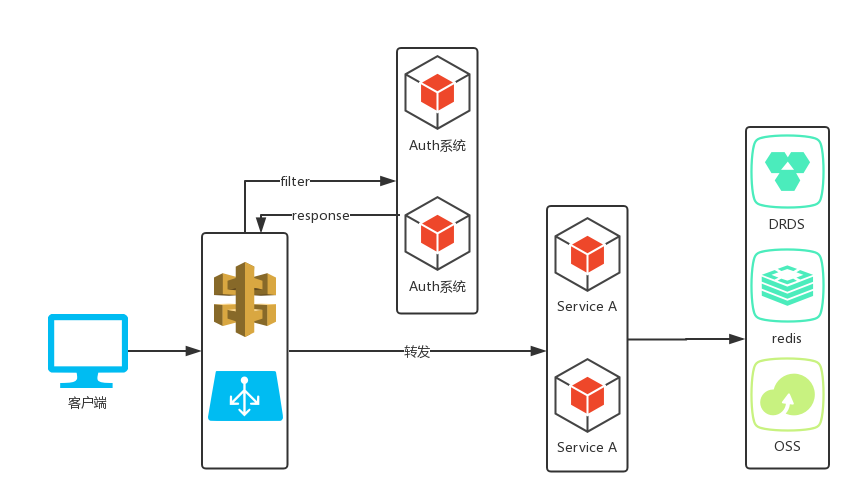

## 解决需求

总的需求分两大类：

1. 认证与鉴权，对于请求的用户身份的授权以及合法性鉴权；
2. API级别的操作权限控制，这个在第一点之后，当鉴定完用户身份合法之后，对于该用户的某个具体请求是否具有该操作执行权限进行校验

## 流程

整个流程分为两类：

1. 用户尚未登录。客户端（web和移动端）发起登录请求，网关对于登录请求直接转发到auth服务，auth服务对用户身份信息进行校验，最终将身份合法的token返回给客户端。
2. 用户已登录，请求其他服务。这种情况，客户端的请求到达网关，网关会调用auth系统进行请求身份合法性的验证，验证不通则直接拒绝，并返回401；如果通过验证，则转发到具体服务，服务经过过滤器，根据请求头部中的userId，获取该user的安全权限信息。利用切面，对该接口需要的权限进行校验，通过则proceed，否则返回403。

